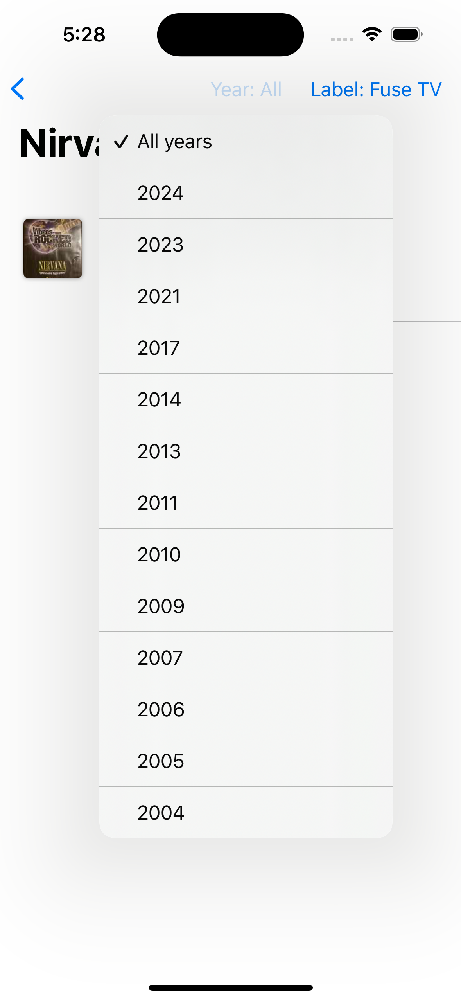

# Clara Mobile Challenge

This app is designed to implement the requirements listed [here](https://clarahub.notion.site/Mobile-Challenge-10711d068efc80b199dde20b4b136533).

It was developed following the MVVM architecture with SwiftUI using Xcode 15.3, targeting iOS 15.

## App Features
- Localizations in English and Spanish
- Support for light and dark mode
- Support for iPad
- Support for landscape and portrait orientations

## Considerations Regarding the Requirements

### Point 3.3 Artist's Albums View:
> "Implement filtering options in the discography, allowing users to filter albums by year, genre, or label."

After researching the Discogs API documentation ([Discogs Developers](https://www.discogs.com/developers/)), no endpoint was found that provides the "genre" parameter. Therefore, it was omitted. For this screen, the "Artist Releases" endpoint (`GET /artists/{artist_id}/releases`) was used.

At one point, the "Search" API, which can return `releases` based on search criteria, was considered. However, no method was found to return releases based on an artist ID.

Additionally, the "Artist Releases" endpoint does not support filtering parameters like year, genre, or label. Hence, local filtering was implemented based on the data received from the paginated endpoint. As a result, the filter options for year and label are determined by the data returned in each response page.

## Project Organization

- **Clara Mobile Challenge:**
  - **Discogs API:** Contains abstractions and implementations for querying the Discogs online database.
  - **Screens:** Implementations of the app screens.
  - **Util:** Utilities and extensions used in the app.
  - **Views:** Implementations of visual components.
    - **Cached Async Image:** A replacement for AsyncImage with in-memory cache support, allowing future integration with disk-based caching.

- **Clara Mobile ChallengeTests:**
  - **DiscogsLoader Tests:** Tests related to the Discogs API loader.
  - **SearchScreenViewModel Tests:** Tests for the view model used in the search screen.

Although not all use cases and flows were covered by tests, the goal was to establish a template and demonstrate that testing the created components is feasible to ensure their expected functionality.

## Setup and Running
1. Open the project `Clara Mobile Challenge.xcodeproj`.
2. Select the desired run destination.
3. Click "Run."

The project can run on iOS 15 or later devices, both iPhone and iPad.

## Code Analysis with SwiftLint
SwiftLint is integrated into the project using Swift Package Manager via Xcode. It runs during each build to enforce style and best practices based on the [The Official Kodeco Swift Style Guide](https://github.com/kodecocodes/swift-style-guide). Detected warnings were progressively resolved during development.

If this message appears: **"Trust & Enable All"**, ensure to approve it to enable SwiftLint.

## Screenshots

# Screenshots

## Search Screen

## Artist Detail Screen

# Artist Releases Screen

# Filters

